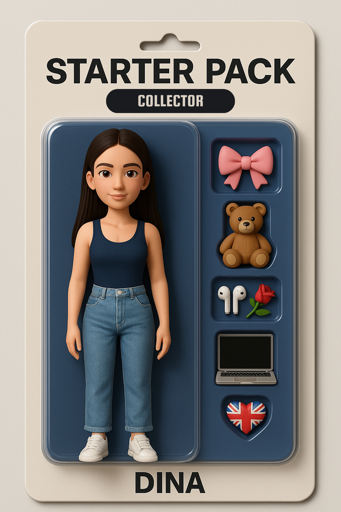

<table align="center" width="95%" cellpadding="10" cellspacing="0" style="border-collapse: collapse; border: none; border-spacing: 0;">
  <tr>
    <td align="center" width="250" style="border: none; border-style: none; vertical-align: top;">
      
    </td>
    <td style="text-align: left; padding-left: 25px; border: none; border-style: none; vertical-align: top;">
      

        🚀 Computer Science Engineering Student @ <a href="https://www.epita.fr" target="_blank" style="color: #89B4FA; text-decoration: none; font-weight: bold;">EPITA</a> (Paris). 
        Passionate about <strong>Cybersecurity</strong>, <strong>Problem-Solving</strong>, and exploring <strong>Web & Mobile Development</strong>. 
        💡 Driven student thriving on challenges, eager to build tangible solutions.
      

      

        🔭 Currently focusing on: Web Development & IT Security.
      

       

         🌐 Discover more on my website: <a href="https://dinaosaure.github.io" target="_blank" style="color: #89B4FA; text-decoration: none; font-weight: bold;">dinaosaure.github.io</a>
       

    </td>
  </tr>
</table>

---

## 🛠️ Tech Stack & Skills

### 💻 Programming Languages

     
     
     
     
     
     
  

###  Tools & Technologies

     
     
     
     
     
     
     
     
     
     
     
     
     
     
  

### ⚙️ Operating Systems

     
     
     
     
  

---

## 📊 GitHub Stats & Activity

  
  

  

---

## 🚀 Projects Showcase

*   [**Personal Website**](https://github.com/dinaosaure/dinaosaure.github.io): This portfolio site! Built with HTML, CSS, JS, hosted on GitHub Pages. ✨
*   [**GreenWatch App (UPM)**](https://github.com/lucasbnrd05/flutter_app): Flutter app (Kotlin backend) monitoring drought/flood impacts using real-time data & sensors. 🌳💧 *(Mobile Dev Course)*
*   [**Kotlin Android App (UPM)**](https://github.com/lucasbnrd05/epitie): Android app developed during Mobile App Development course, applying advanced concepts. 📱 *(Kotlin)*
*   [**S3 Project "Hidden Palace" (EPITA)**](https://github.com/dinaosaure/HiddenPalace): Word search solver in C, including neural network development. 🧠 *(C Language)*
*   **AFIT (EPITA):** Transcription of advanced arithmetic algorithms into OCaml. 🐫 *(OCaml, Source code private)*
*   [**Video Game "Devs" (EPITA)**](https://github.com/CelinaMeiLin/SUPERDEVS): Led the development of a rogue-like game. 🎮 *(C# / Godot Engine)*

---

## 🌱 Beyond the Code

  Actively volunteering with <a href="https://prologin.org/" target="_blank" style="color: #89B4FA;">Association Prologin</a>, introducing CS concepts in schools and through <a href="https://girlscancode.fr/" target="_blank" style="color: #89B4FA;">"Girls Can Code!"</a> stages! 👩‍💻 
  🎵 Also a passionate musician with a Certificate of Musical Studies (CEM) – playing Violin 🎻 & Piano 🎹 after years at the conservatory.

---

## 📫 Let's Connect!

Feel free to reach out or connect with me:

  <!-- Utilisation du style 'social' pour les badges -->
  
  <!-- !!! Vérifie que ce lien LinkedIn est correct !!! -->
  
  
  

---

<!-- GIF Sélectionné -->

  <!-- Option 2: Coding Girl / Focused -->
  

<!--- Utilise 'dinaosaure/dinaosaure' -->
<!---
dinaosaure/dinaosaure is a ✨ special ✨ repository because its `README.md` (this file) appears on your GitHub profile.
--->
